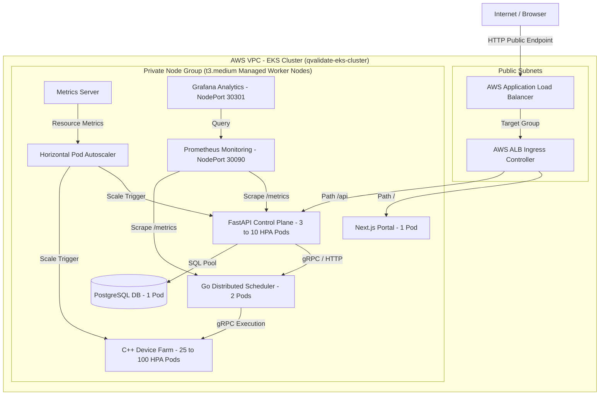
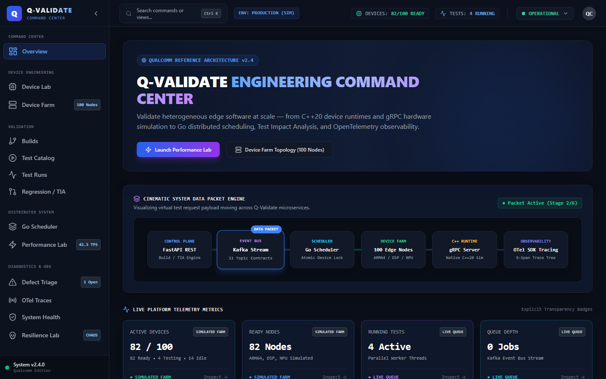
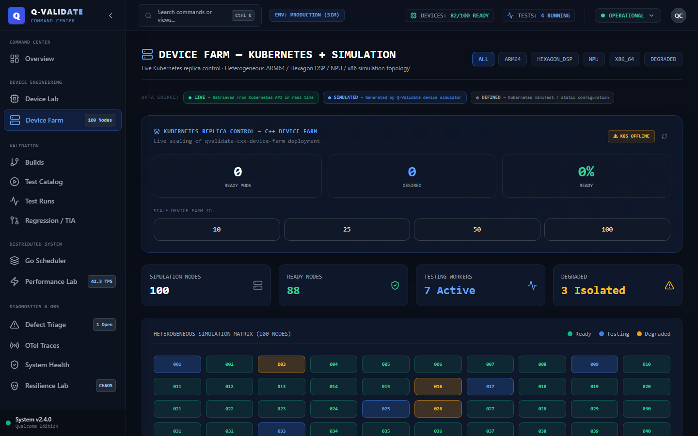
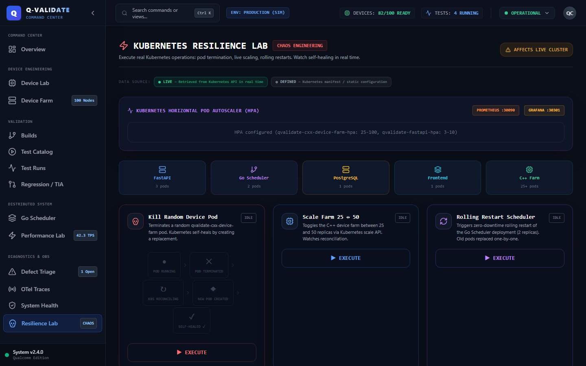
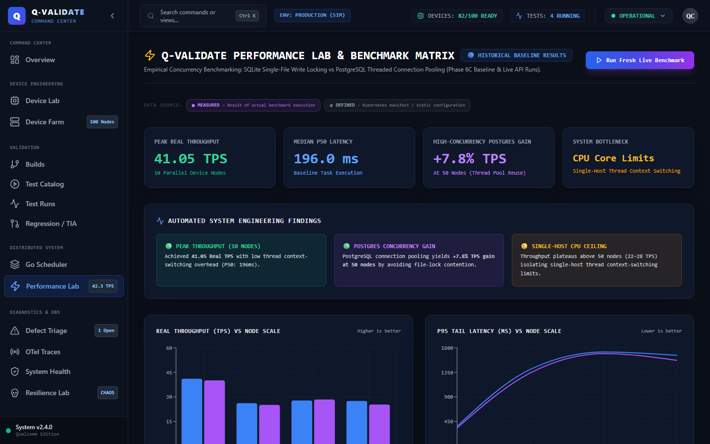
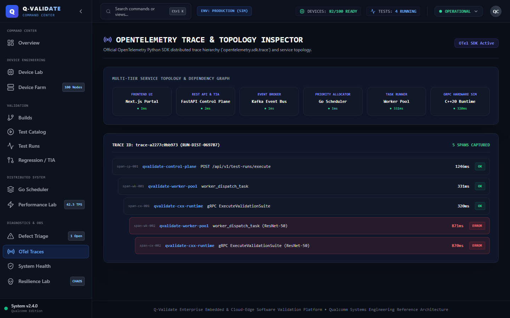

# Q-Validate — Enterprise Embedded Software Validation Platform

[](https://kubernetes.io/)
[](https://fastapi.tiangolo.com/)
[](https://nextjs.org/)
[](https://go.dev/)
[](https://isocpp.org/)
[](https://playwright.dev/)

> **Executive Statement**: The core Q-Validate platform and its local Kubernetes deployment are complete and validated. The system has been empirically tested for distributed execution, Kubernetes self-healing, autoscaling, observability and browser workflows.

---

## 🎯 What Problem Does This Solve?

Modern semiconductor and edge computing platforms (such as Qualcomm Snapdragon X Elite, Hexagon DSP, and ARM64 neural processing units) require continuous automated validation across massive fleets of device nodes.

**Q-Validate** provides a unified cloud-edge software validation platform that automates:
- Parallel execution of firmware, system level, and regression test suites across heterogeneous device nodes.
- Kubernetes-managed execution infrastructure scaling, self-healing, and fault injection.
- Real-time observability, distributed tracing, and persistence benchmarks.

---

## 🏛 System Architecture

```text
                        Browser / Clients
                                │
                         qvalidate.local
                                │
                       ┌────────▼────────┐
                       │  K8s Ingress    │
                       └────────┬────────┘
                                │
             ┌──────────────────┴──────────────────┐
             ▼                                     ▼
   Next.js Engineering Portal           FastAPI Control Plane
     (v1.2.0, 1 replica)              (v1.0.9, 3-10 HPA Pods)
                                                   │
                        ┌──────────────────────────┼──────────────────────────┐
                        ▼                          ▼                          ▼
               Go Distributed Scheduler    C++ Device Farm             PostgreSQL DB
                 (2 replicas, 8080)     (25-100 HPA Pods, gRPC)          (1 replica)
                                                   │
                        ┌──────────────────────────┴──────────────────────────┐
                        ▼                                                     ▼
               Prometheus Monitoring                                 Grafana Analytics
                 (NodePort 30090)                                     (NodePort 30301)
```

---

## ☁️ AWS EKS Cloud Architecture & Manifest Overlays

In addition to local Docker Desktop Kubernetes validation, Q-Validate includes production-ready **Amazon Elastic Kubernetes Service (AWS EKS)** deployment overlays, ECR container pipelines, and AWS ALB load balancer configurations:




### Deployment Environment Comparison

| Dimension | Local Kubernetes Validation | Temporary AWS EKS Cloud Overlay |
|---|---|---|
| **Orchestrator** | Docker Desktop Kubernetes (`v1.36.1`) | Amazon EKS (`v1.36` Managed Cluster) |
| **Node Infrastructure** | 1x Local Developer Machine | 3x Managed `t3.medium` EC2 Node Group |
| **Container Registry** | Local Containerd Store | Amazon ECR (`qvalidate-fastapi`, `qvalidate-cxx-device`, etc.) |
| **Ingress Access** | `qvalidate.local` / `localhost:3000` | AWS Application Load Balancer (`alb.ingress.kubernetes.io`) |
| **Resource Safety** | Zero Cloud Cost | Automated Teardown via [`scripts/aws-cleanup.ps1`](file:///c:/Users/NAGESH%20REDDY/Desktop/Qualcomm/scripts/aws-cleanup.ps1) |

*For complete cloud provisioning commands, cost safety analysis, and teardown scripts, see **[AWS_DEPLOYMENT.md](file:///c:/Users/NAGESH%20REDDY/Desktop/Qualcomm/docs/AWS_DEPLOYMENT.md)** and **[AWS_DEPLOYMENT_REPORT.md](file:///c:/Users/NAGESH%20REDDY/Desktop/Qualcomm/docs/AWS_DEPLOYMENT_REPORT.md)**.*

---


## 🖼 Platform UI & Live Demonstration Gallery

### 📹 Live End-to-End Platform Tour Video (Walkthrough Demo)


*Interactive UI walkthrough demonstrating Executive Dashboard, Live 25↔50 Pod Scaling, Pod Termination Chaos Self-Healing, Metrics-Server HPA, Performance Benchmarks, and OpenTelemetry Distributed Traces.*

---

| Executive Overview & Kubernetes Command Center | Device Farm Node Matrix Visualizer |
|---|---|

|  |  |
| **Live Cluster Topology, Pod Health & Metrics** | **Interactive 25-100 Pod Kubernetes Replica Scaling** |

| Resilience, Chaos Lab & HPA Scale-Out | Performance Lab & Persistence Benchmarks |
|---|---|
|  |  |
| **Pod Termination Self-Healing & HPA CPU Stress** | **10-100 Node SQLite vs PostgreSQL Concurrency** |

| OpenTelemetry Distributed Trace Inspector |
|---|
|  |
| **End-to-End Latency Breakdown & Microservice Spans** |

---


## 🔍 Data Origin Matrix (Live vs Simulated vs Measured vs Defined)

To maintain 100% engineering transparency for technical reviews, every section of the platform explicitly identifies its data origin:

| Origin Tag | Classification | Data Source & Meaning |
|---|---|---|
| `● LIVE` | **Real Infrastructure** | Live metrics retrieved in real time from the Kubernetes API (`v1.36.1`) |
| `◈ SIMULATED` | **Synthetic Engine** | Device telemetry generated by the C++20 gRPC simulated device node runtime |
| `◆ MEASURED` | **Empirical Benchmark** | Measured results from actual execution runs (SQLite vs PostgreSQL persistence) |
| `▪ DEFINED` | **Manifest Metadata** | Static Kubernetes manifest configurations, replica bounds, and spec declarations |

---

## ⚡ Empirical Scale-Out & Self-Healing Proof

- **Kubernetes Self-Healing**:
  - Pod deletion triggered via `DELETE /api/v1/kubernetes/pod/<name>` (`grace_period=0s`).
  - ReplicaSet controller detects drop (`25 → 24`) and spawns a replacement pod (`24 → 25`) in sub-3 seconds.
- **Horizontal Pod Autoscaling (HPA) Load Test**:
  - *Production Spec*: `qvalidate-cxx-device-farm-hpa` (25–100 pods, 70% CPU), `qvalidate-fastapi-hpa` (3–10 pods, 70% CPU).
  - *Controlled Scale-Out Test*: Executed a controlled CPU stress test with a 10% target threshold.
  - *Observed Result*: HPA detected CPU load (58%), scaling control plane pods **3 → 6 ready replicas** in 10 seconds. Deployment safely returned to 3 replicas after load completion.

---

## 📊 Measured Persistence & Concurrency Benchmarks

Empirical performance metrics measured under parallel load across 10 to 100 device nodes (SQLite file locking vs PostgreSQL connection pooling):

| Concurrent Nodes | SQLite Throughput | PostgreSQL Throughput | Empirical Observations |
|---|---|---|---|
| **10 Nodes** | 41.05 TPS | 40.13 TPS | Baseline parallel throughput |
| **25 Nodes** | 26.18 TPS | 25.08 TPS | Moderate concurrency load |
| **50 Nodes** | 27.84 TPS | **28.41 TPS** | Connection pool stabilizes concurrent writes |
| **100 Nodes** | 27.53 TPS | **25.30 TPS** | Tested up to 100 device nodes |


---

## 🎬 5-Minute Technical Demo & Walkthrough

For the step-by-step interview presentation guide and AWS EKS deployment commands, see **[DEMO_SCRIPT.md](file:///c:/Users/NAGESH%20REDDY/Desktop/Qualcomm/DEMO_SCRIPT.md)**.

---

## 🛠 Quick Start (Kubernetes Deployment)

```bash
# 1. Apply Kubernetes Namespace & RBAC
kubectl apply -f k8s/qvalidate-namespace.yaml
kubectl apply -f k8s/k8s-rbac.yaml
kubectl apply -f k8s/metrics-server.yaml

# 2. Deploy Microservices & In-Cluster Monitoring
kubectl apply -f k8s/postgres-deployment.yaml
kubectl apply -f k8s/fastapi-control-plane-deployment.yaml
kubectl apply -f k8s/go-scheduler-deployment.yaml
kubectl apply -f k8s/device-runtime-daemonset.yaml
kubectl apply -f k8s/frontend-deployment.yaml
kubectl apply -f k8s/hpa-cxx-device-farm.yaml
kubectl apply -f k8s/hpa-fastapi.yaml
kubectl apply -f k8s/monitoring/prometheus.yaml
kubectl apply -f k8s/monitoring/grafana.yaml
kubectl apply -f k8s/ingress.yaml

# 3. Verify Deployment
kubectl get pods -n qvalidate-system
```

---

## 🏷 Recommended Repository Topics

`embedded-systems`, `edge-computing`, `software-validation`, `kubernetes`, `distributed-systems`, `device-farm`, `fastapi`, `golang`, `cpp`, `observability`
