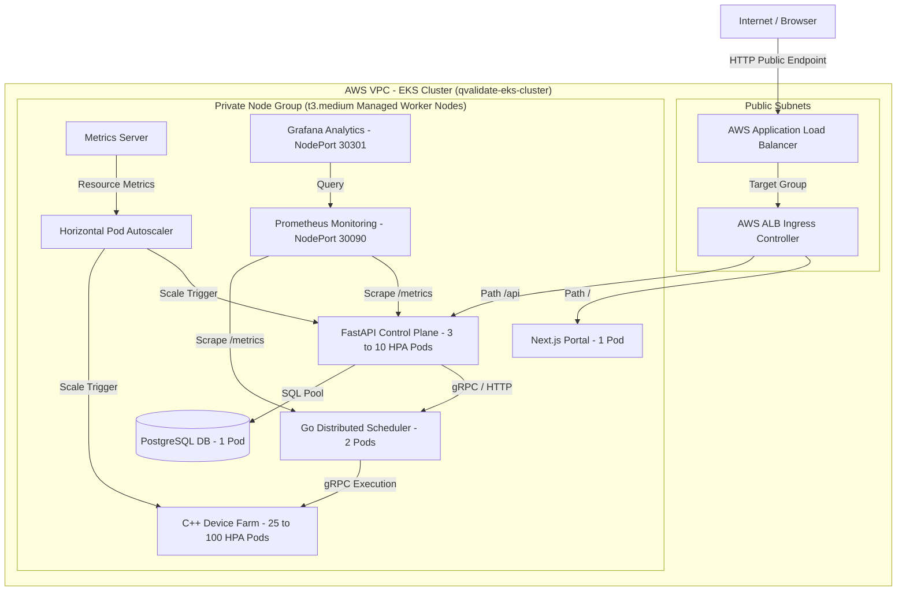

# Q-Validate — AWS EKS Cloud Deployment Architecture & Runbook

This runbook documents the temporary cloud deployment architecture, manifest overlays, container registry pipelines, cost safety controls, and verification framework for deploying **Q-Validate** to **Amazon Elastic Kubernetes Service (Amazon EKS)**.

---

## 🏛 AWS EKS Cloud Architecture

### Mermaid Diagram




### System Topology ASCII Diagram

```text
                        Internet / Public Clients
                                   │
                    AWS Application Load Balancer (ALB)
                                   │
                      ┌────────────▼────────────┐
                      │  AWS EKS Ingress Class  │
                      └────────────┬────────────┘
                                   │
             ┌─────────────────────┴─────────────────────┐
             ▼                                           ▼
   Next.js Portal (v1.2.0)                    FastAPI Control Plane (v1.0.9)
   [ECR: qvalidate-frontend]                 [ECR: qvalidate-fastapi]
                                                         │
                        ┌────────────────────────────────┼────────────────────────────────┐
                        ▼                                ▼                                ▼
             Go Distributed Scheduler            C++ Device Farm                    PostgreSQL DB
             [ECR: qvalidate-go-scheduler]       [ECR: qvalidate-cxx-device]        (1 Pod, 5432)
                        │                                │
                        └────────────────────────────────┼────────────────────────────────┐
                                                         ▼                                ▼
                                               Prometheus Monitoring              Grafana Analytics
                                                  (NodePort 30090)                 (NodePort 30301)
```

---

## 📋 10-Phase Cloud Deployment Strategy

### Phase 1: Environment & Tooling Audit
Prior to resource creation, verify local tooling:
```bash
aws --version
kubectl version --client
eksctl version
docker --version
aws sts get-caller-identity
```

### Phase 2: Amazon ECR Container Registry Setup
Create ECR repositories and push immutable version tags:
```bash
# Set AWS Region & Account ID
export AWS_REGION=us-west-2
export AWS_ACCOUNT_ID=$(aws sts get-caller-identity --query Account --output text)

# Create Repositories
aws ecr create-repository --repository-name qvalidate-fastapi --region $AWS_REGION
aws ecr create-repository --repository-name qvalidate-go-scheduler --region $AWS_REGION
aws ecr create-repository --repository-name qvalidate-cxx-device --region $AWS_REGION
aws ecr create-repository --repository-name qvalidate-frontend --region $AWS_REGION

# Authenticate Docker & Push Images
aws ecr get-login-password --region $AWS_REGION | docker login --username AWS --password-stdin $AWS_ACCOUNT_ID.dkr.ecr.$AWS_REGION.amazonaws.com

docker tag qvalidate-fastapi:v1.0.9 $AWS_ACCOUNT_ID.dkr.ecr.$AWS_REGION.amazonaws.com/qvalidate-fastapi:v1.0.9
docker tag qvalidate-go-scheduler:v1.0.0 $AWS_ACCOUNT_ID.dkr.ecr.$AWS_REGION.amazonaws.com/qvalidate-go-scheduler:v1.0.0
docker tag qvalidate-cxx-device:v1.0.1 $AWS_ACCOUNT_ID.dkr.ecr.$AWS_REGION.amazonaws.com/qvalidate-cxx-device:v1.0.1
docker tag qvalidate-frontend:v1.2.0 $AWS_ACCOUNT_ID.dkr.ecr.$AWS_REGION.amazonaws.com/qvalidate-frontend:v1.2.0

docker push $AWS_ACCOUNT_ID.dkr.ecr.$AWS_REGION.amazonaws.com/qvalidate-fastapi:v1.0.9
docker push $AWS_ACCOUNT_ID.dkr.ecr.$AWS_REGION.amazonaws.com/qvalidate-go-scheduler:v1.0.0
docker push $AWS_ACCOUNT_ID.dkr.ecr.$AWS_REGION.amazonaws.com/qvalidate-cxx-device:v1.0.1
docker push $AWS_ACCOUNT_ID.dkr.ecr.$AWS_REGION.amazonaws.com/qvalidate-frontend:v1.2.0
```

### Phase 3: Amazon EKS Cluster Provisioning
Provision a low-cost EKS cluster using `eksctl`:
```bash
eksctl create cluster \
  --name qvalidate-eks-cluster \
  --region us-west-2 \
  --nodegroup-name qvalidate-nodes \
  --node-type t3.medium \
  --nodes 3 \
  --nodes-min 2 \
  --nodes-max 5 \
  --managed
```

### Phase 4: Kubernetes Manifest Adaptation (Overlay)
Apply core namespace, RBAC, metrics-server, and AWS-specific ECR overlays:
```bash
kubectl apply -f k8s/qvalidate-namespace.yaml
kubectl apply -f k8s/k8s-rbac.yaml
kubectl apply -f k8s/metrics-server.yaml
kubectl apply -f k8s/postgres-deployment.yaml
kubectl apply -f k8s/aws/aws-ecr-deployments.yaml
kubectl apply -f k8s/go-scheduler-deployment.yaml
kubectl apply -f k8s/hpa-cxx-device-farm.yaml
kubectl apply -f k8s/hpa-fastapi.yaml
kubectl apply -f k8s/monitoring/prometheus.yaml
kubectl apply -f k8s/monitoring/grafana.yaml
```

### Phase 5: AWS ALB Ingress & Internet Access
Expose the frontend portal via AWS ALB:
```bash
kubectl apply -f k8s/aws/aws-ingress.yaml
kubectl get ingress -n qvalidate-system
```

### Phase 6: Verification Framework
```bash
kubectl get nodes
kubectl get pods -n qvalidate-system
kubectl top pods -n qvalidate-system
kubectl get hpa -n qvalidate-system
```

### Phase 7: Live Cloud Demonstration
1. **Device Farm Scaling**: Scale C++ farm from 25 to 50 pods on EKS.
2. **Chaos Self-Healing**: Terminate an active pod and verify ReplicaSet recovery.
3. **HPA Autoscaling**: Trigger CPU load via `/api/v1/kubernetes/stress` and observe pod scale-out.

### Phase 8: Cost Safety & Teardown Protocol
To avoid unintended AWS charges, run the teardown script after demonstration:
```powershell
.\scripts\aws-cleanup.ps1 -ClusterName "qvalidate-eks-cluster" -Region "us-west-2"
```

---

## 💰 Estimated Cost Breakdown (Temporary Demonstration)

| Resource | AWS Product | Instance / Type | Hourly Rate | 24-Hour Cost |
|---|---|---|---|---|
| EKS Control Plane | Amazon EKS | Managed Cluster | \$0.10 / hr | \$2.40 |
| Worker Nodes (3x) | Amazon EC2 | `t3.medium` (2 vCPU, 4GB) | \$0.0416 / hr x 3 | \$3.00 |
| Load Balancer | AWS ALB | Application Load Balancer | \$0.0225 / hr | \$0.54 |
| ECR Storage | Amazon ECR | 4 Repositories (~1.5GB) | Negligible | < \$0.05 |
| **Total Estimated** | | | **~ \$0.164 / hr** | **~ \$3.99 / day** |
